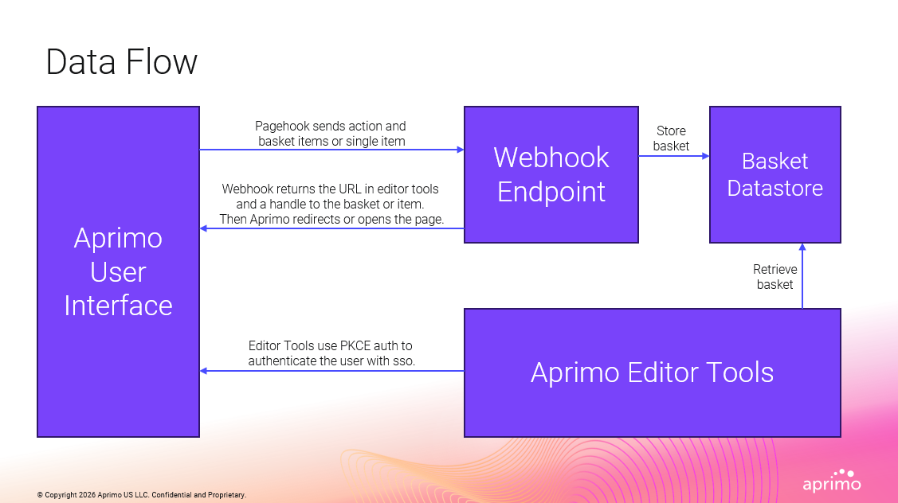

# aprimo-pkce-starter-kit-nextjs

A Next.js starter for building custom Aprimo integrations. Handles PKCE authentication, webhook routing, and basket storage out of the box so you can focus on building your feature.

> Relies on the [Aprimo JS SDK](https://github.com/Timw255/aprimo-js) by [@Timw255](https://github.com/Timw255) for all Aprimo API communication.

---

## Pages

### My Basket

Receives a multi-record page hook from Aprimo. Record IDs are stored in Supabase and a `requestId` handle is forwarded to the page, where the record list is fetched and displayed.

Webhook action: `mybasket`

### My Item

Receives a single-record page hook from Aprimo. The record ID is passed directly as a query parameter and the full asset JSON is displayed on the page.

Webhook action: `myitem` with `&mode=singleitem`

---

## Getting Started

### 1. Set up Supabase

The My Basket flow stores temporary record lists in Supabase.

1. Create a free project at [supabase.com](https://supabase.com).
2. Run the schema from [`supabase/create_requested_records.sql`](supabase/create_requested_records.sql) in the Supabase SQL editor to create the `requested_records` table.
3. Copy your project URL and anon key from **Project Settings → API**.

### 2. Configure environment variables

Copy `.env.local.example` to `.env.local` and fill in the values:

```
NEXT_PUBLIC_SUPABASE_URL=https://your-project.supabase.co
NEXT_PUBLIC_SUPABASE_ANON_KEY=your-anon-key

NEXT_PUBLIC_APRIMO_ENVIRONMENT=yourcompany
NEXT_PUBLIC_APRIMO_CLIENT_ID=your-client-id
NEXT_PUBLIC_APRIMO_CLIENT_SECRET=your-client-secret

# Optional: shared secret to verify incoming webhook signatures (HMAC-SHA256).
# If omitted, signature verification is skipped. To make it required, change
# the early-return in app/api/webhook/route.ts from `return true` to `return false`.
WEBHOOK_SECRET=your-webhook-secret
```

### 3. Create a PKCE registration in Aprimo

1. In Aprimo go to **Settings → Registrations** and create a new registration:
   - **Grant type:** Authorization Code with PKCE
   - **Redirect URI:** `https://<your-site>/oauth/callback` (or `http://localhost:3000/oauth/callback` for local dev)
2. Copy the **Client ID** and **Client Secret** into your `.env.local`.

### 4. Install and run

```
npm install
npm run dev
```

The app authenticates automatically on load using the env vars — no login screen.

### 5. Configure webhook actions

Update [`app/api/webhook/actions.json`](app/api/webhook/actions.json) with your deployment URLs:

```json
{
  "mybasket": "https://your-site.vercel.app/my-basket",
  "myitem":   "https://your-site.vercel.app/my-item",

  "mybasketlocal": "http://localhost:3000/my-basket",
  "myitemlocal":   "http://localhost:3000/my-item"
}
```

### 6. Register page hooks in Aprimo

Create an action definition in Aprimo for each hook:

```json
{
  "name": "myAction",
  "type": "pageHook",
  "translationKey": "",
  "conditions": [],
  "parameters": {
    "sendToken": "none",
    "url": "https://<your-site>/api/webhook?action=myaction",
    "location": "New",
    "timeout": 30,
    "httpMethod": "POST"
  }
}
```

Append `&mode=singleitem` for single-record actions (e.g. My Item):

```
# Multi-record — stores record list in Supabase and returns a requestId
https://<your-site>/api/webhook?action=mybasket

# Single-record — passes the record ID directly
https://<your-site>/api/webhook?action=myitem&mode=singleitem
```

Then add the action to the appropriate Aprimo menu:

```json
{ "name": "<action name>", "type": "action" }
```

---

## How It Works

1. **Page hook trigger** — Aprimo POSTs to `/api/webhook` with the action name and record ID(s).
2. **Store basket** — For multi-record actions the webhook stores the record list in Supabase and generates a `requestId` handle.
3. **Redirect** — The webhook returns the app URL with the handle (or record ID for single-item mode). Aprimo opens it in the user's browser.
4. **PKCE auth** — The app authenticates automatically via PKCE OAuth on page load.
5. **Retrieve basket** — Once authenticated, the page fetches the record list from Supabase using the `requestId`, then deletes the row.


